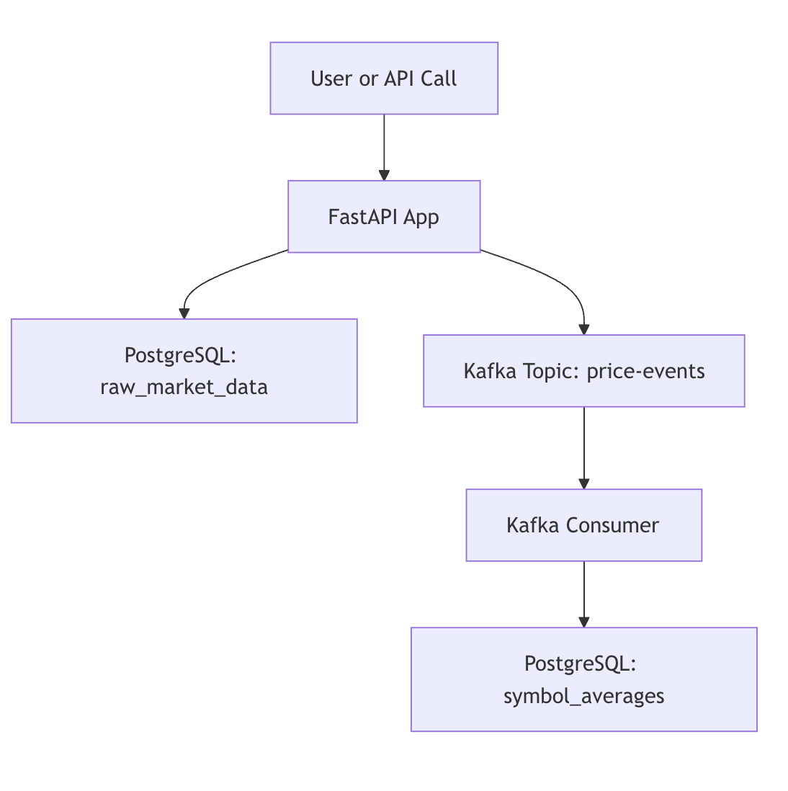

# 📈 Market Data Analysis Platform

This project is a real-time **market data ingestion and analysis pipeline** built using **FastAPI**, **Kafka**, **PostgreSQL**, and **Docker**. It fetches latest stock prices from Alpha Vantage API, stores raw data in a database, publishes events to Kafka, and computes a **5-point moving average** via a background Kafka consumer.

---

## 🧠 Features

- ⏱ Fetch latest price data from Alpha Vantage via `/prices/latest`
- 💾 Store raw responses into PostgreSQL
- 📤 Publish price events to Kafka (`price-events` topic)
- 🧮 Compute moving averages and update `symbol_averages` table
- 🐳 Fully containerized via Docker Compose
- ✅ CI with GitHub Actions for linting, building, and integration test

---

## 🏗️ Architecture Overview



---

## How to Run

### 1. Clone the repo and enter the directory

```bash
git clone https://github.com/yourusername/market-data-service.git
cd market-data-service

2. Create and activate a virtual environment
python3 -m venv venv
source venv/bin/activate  # For Windows: venv\Scripts\activate

3. Install dependencies
pip install -r requirements.txt

4. Add your .env file
ALPHA_VANTAGE_API_KEY=your_api_key_here

